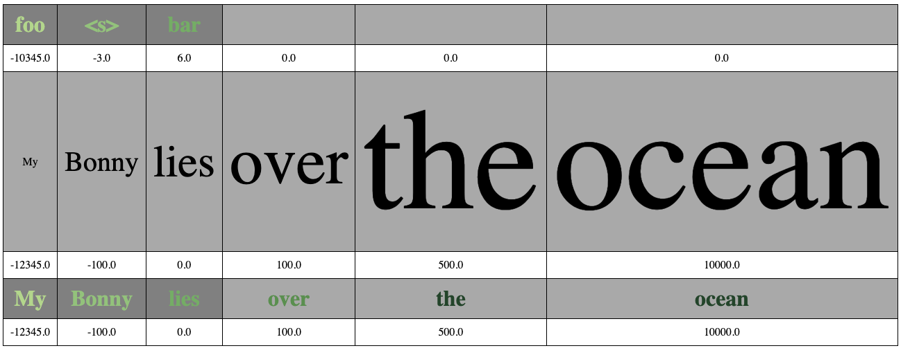

# trulens_viz

   <h1 align="center">Visualize NLP results for human consumption</h1>


The `nlp_viz.HTMLTable` class takes phrases for which per-word attribution logits are available. A phrase is provided to the class as a list of (word, attribution_score) tuples. Instances create a table with pairs of lines, one pair for each phrase. The first line shows the phrase's sequence of words, styled with one of two methods for communicating the word's attribution score: color, or size. The second line shows the logits below each word.



## Installation

After cloning, and creation of a virtual environment:

```
pip install -r requirements
```

## Usage

The above table display was created via this code:

```
word_attrs = [('foo', -10345), ('<s>', -3), ('bar', 6)]
tbl = HTMLTable(word_attrs, word_styling=WordStyles.FONT_COLOR)

# Add a second phrase, using fontsize as attribution score indicator:

tbl.add_rows([('My', -12345.), 
              ('Bonny', -100),
               ('lies', 0), 
               ('over', 100), 
               ('the', 500), 
               ('ocean', 10000.)],
              word_styling=WordStyles.FONT_SIZE)

# The third phrase, uses font color instead of size:

tbl.add_rows([('My', -12345.), 
              ('Bonny', -100),
               ('lies', 0), 
               ('over', 100), 
               ('the', 500), 
               ('ocean', 10000.)],
              word_styling=WordStyles.FONT_COLOR)

print(str(tbl.doc))
```
The printed string was transferred to a file, and opened in a browser. Alternatively, one can use the Python webbrowser package to open the file from code.

The code collects all scores, and sorts them into quantile bins (default is five bins). A word's bin membership determines the word's color or fontsize for display. Currently all logits from all phrases in a table are used for quantiling. One could experiment with using only the logits within one phrase for that phrase's display.

